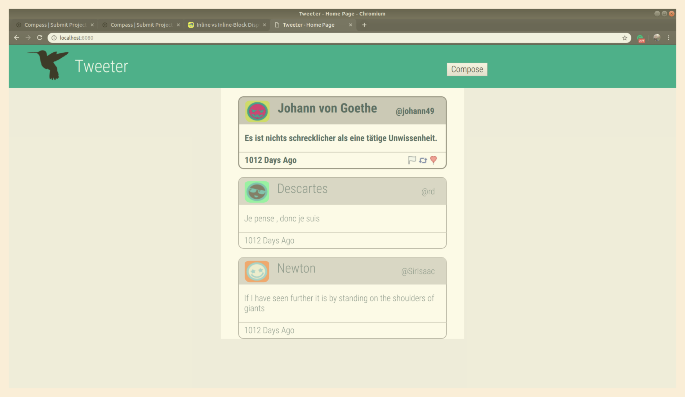
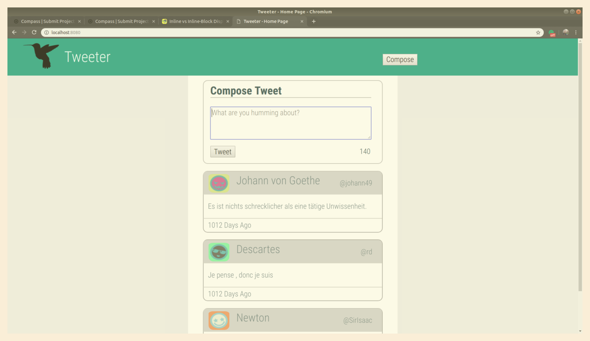
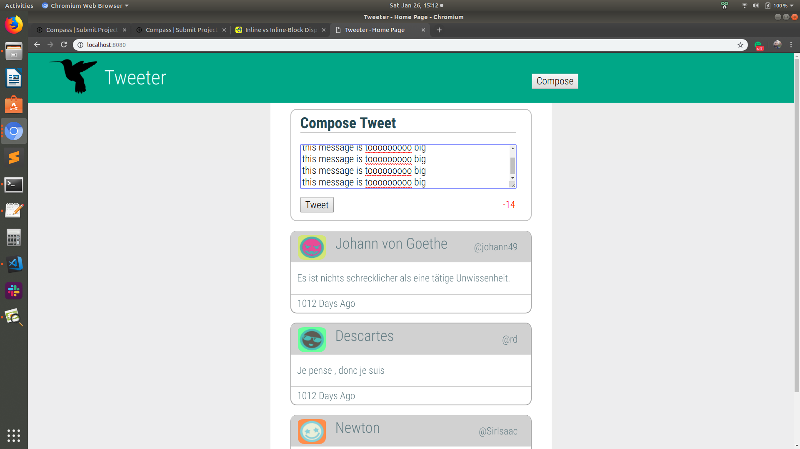

# Tweeter Project

Tweeter is a simple, single-page Twitter clone.

This repository is the starter code for the project: Students will fork and clone this repository, then build upon it to practice their HTML5, CSS, JS, jQuery and AJAX front-end skills, and their Node, Express and MongoDB back-end skills.

## Getting Started

1. Fork this repository, then clone your fork of this repository.
2. Install dependencies using the `npm install` command.
3. Start the web server using the `node server/index.js` command.
4. Go to <http://localhost:8080/> in your browser.
5. For development and test purposes, there is a file in server/lib/util/mongo_example.js which cleans and starts the database with 3 documents.

## Dependencies

- Express
- Node 5.10.x or above
- Body-parser
- Chance
- Md5
- Mongodb

## Images
* **Main Page** 

* **Compose Screen**

* **Dealing with big messages**

## Improvements
- User's register and actions/functions regarding this feature
- Aplly actions to the buttos/icons
- Better Responsive Design
 
